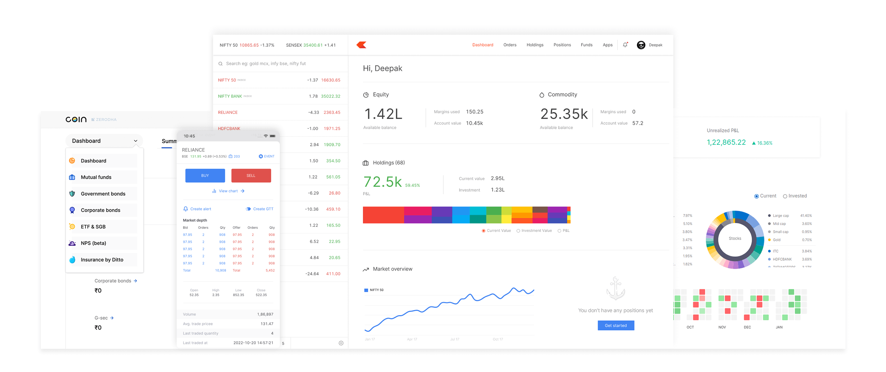
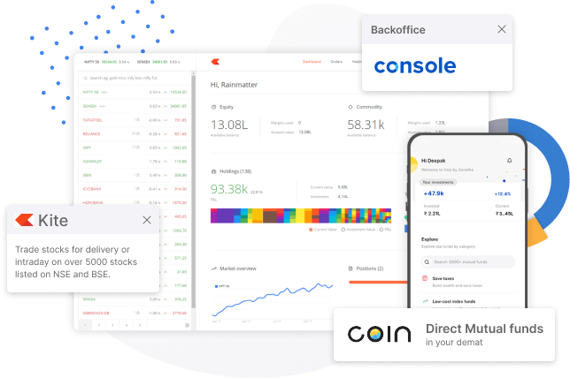
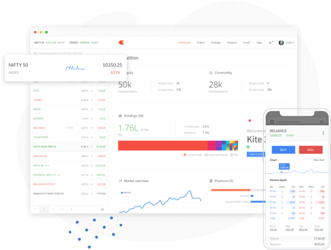
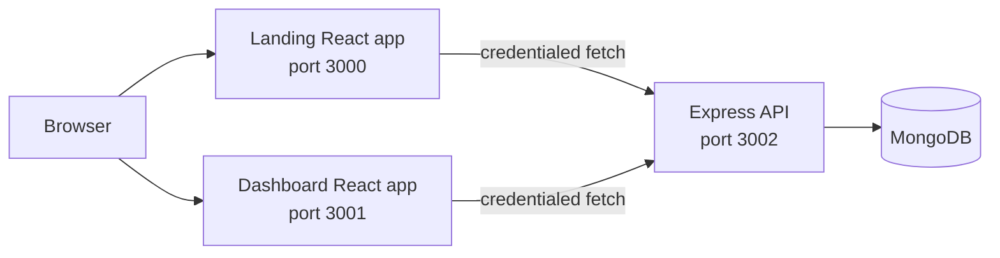

# TradeX

TradeX is a full-stack trading dashboard prototype with a public landing site, a protected portfolio dashboard, and an Express/MongoDB API.

## Screenshots

### Landing page




### Dashboard branding


### Sign-up experience



### Trading workspace



The repository also contains the dashboard's live UI under `dashboard/src/components` and the landing experience under `frontend/src/landing_page`.

## Architecture



- `frontend`: public marketing pages, sign-up, sign-in, and navigation.
- `dashboard`: authenticated portfolio views for summary, orders, holdings, positions, funds, and apps.
- `backend`: Express routes, JWT session creation, MongoDB models, and trading endpoints.
- Authentication uses an `HttpOnly` `tradexSession` cookie. Tokens are never placed in URLs or browser local storage.

## Prerequisites

- Node.js 18 or newer
- npm
- MongoDB, local or hosted

## Setup

Install dependencies in each application:

```bash
npm --prefix backend install
npm --prefix frontend install
npm --prefix dashboard install
```

Create `backend/.env`:

```env
MONGO_URL=mongodb://127.0.0.1:27017/tradex
JWT_SECRET=replace-with-a-long-random-secret
FRONTEND_URL=http://localhost:3000
DASHBOARD_URL=http://localhost:3001
PORT=3002
```

Start the API and both React applications in separate terminals:

```bash
npm --prefix backend start
npm --prefix frontend start
npm --prefix dashboard start
```

Open `http://localhost:3000`. Sign up or sign in, then open the dashboard from the navigation. In production, set `NODE_ENV=production`, use HTTPS, and replace the development origins and MongoDB URL with deployed values.

## Tests

Run the backend endpoint tests:

```bash
npm --prefix backend test
```

Run the frontend tests once in CI mode:

```bash
npm --prefix frontend test -- --watchAll=false
```

Build both React applications:

```bash
npm --prefix frontend run build
npm --prefix dashboard run build
```

The backend tests do not require MongoDB because they cover endpoints that can be exercised without a database. Sign-in, sign-up, and authenticated `/auth/me` paths should also be verified against a configured MongoDB instance.

## Security Notes

- The API restricts credentialed CORS requests to `FRONTEND_URL` and `DASHBOARD_URL`.
- Session cookies are `HttpOnly`, `SameSite=Lax`, and `Secure` in production.
- Logout clears the server-issued session cookie.
- Do not commit `.env` files or production secrets.
